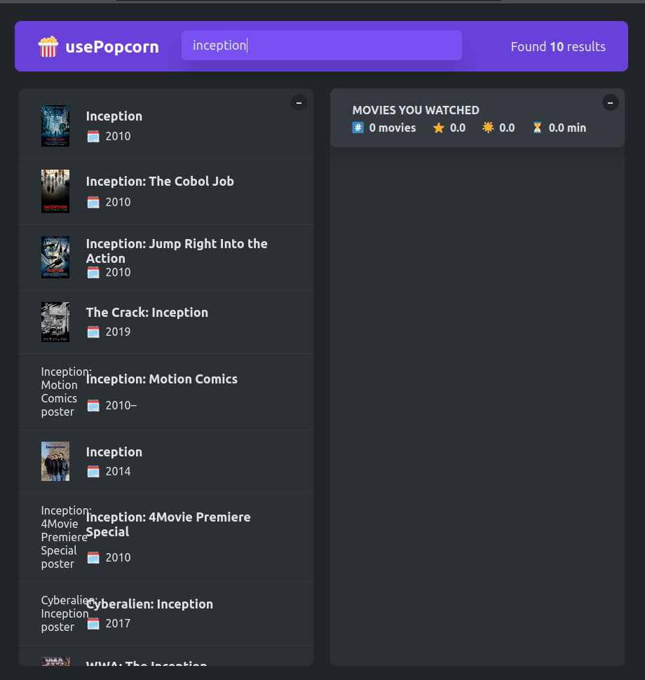

# usePopcorn - Movie Discovery and Rating App


usePopcorn is a single-page React app that allows users to discover movies, rate them, and maintain a personalized "Watched List." It provides a user-friendly interface to search for movies, view movie details, and rate them based on their preferences. The app also includes features to manage a list of movies that the user has already watched.

## Table of Contents

- [Introduction](#usepopcorn---movie-discovery-and-rating-app)
- [Getting Started](#getting-started)
- [Features](#features)
- [Screenshots](#screenshots)
- [Tech Stack](#tech-stack)
- [Contributing](#contributing)
- [License](#license)

## Getting Started

To run the usePopcorn app locally, follow these steps:

1. Clone the repository:

```bash
git clone https://github.com/TheGapie/usePopcorn.git
```

2. Navigate to the project directory:

```bash
cd usePopcorn
```

3. Install dependencies:

```bash
npm install
```

4. Start the development server:

```bash
npm start
```

The app will be accessible at `http://localhost:3000` in your web browser.

## Features

- **Movie Search:** Search for movies based on title, genre, or actor's name. Get relevant movie suggestions as you type.
- **Movie Details:** View detailed information about a selected movie, including the plot, release date, and ratings.
- **Movie Rating:** Rate movies by giving them stars. Save your ratings for future reference.
- **Watched List:** Keep track of movies you have already watched by adding them to your personalized "Watched List."
- **User Saved History:** Users can save watched history for later time, so after they login they can see their previous saved movies and their ratings .

## Screenshots





## Tech Stack

- React
- CSS (for styling)

## Contributing

Contributions to usePopcorn are welcome! If you find a bug or have an idea for an improvement, please create an issue or submit a pull request. Please adhere to the code style and guidelines used in the project.

#### Happy movie discovery and rating with usePopcorn! 🍿🎬
